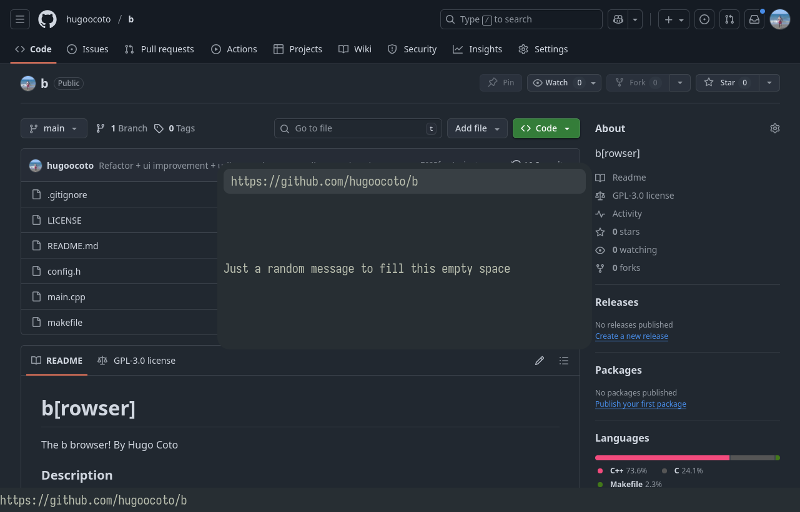

# b\[rowser\]

The b browser! By Hugo Coto

### Description 

Minimal but customizable interface with bloat chromium-based engine. 

There are some mappings that should be known in order to properly use the
browser:
    - `ctrl-l`: Open search input box.
    - `ctrl-h`: Open history navigation box.
    - `ctrl-t`: Toggle url bar visibility.

For questions or support, contact: me@hugocoto.com

### Installation 
Just run `make`. It depends on Qt6 so it have to be installed. Source can be
found on github: https://github.com/hugoocoto/b

### Usage 
You can start b from command line. It accept one parameter, either "--help" or
the url to be opened. You can modify look and keybinds in config.h. Note that
you have to rebuild it after modification.

### License 
    Copyright (C) 2025  Hugo Coto Flórez
    
    b is free software; you can redistribute it and/or modify it under the terms
    of the GNU General Public License as published by the Free Software
    Foundation, either version 3 of the License, or any later version.
    
    b is distributed in the hope that it will be useful, but WITHOUT ANY
    WARRANTY; without even the implied warranty of MERCHANTABILITY of FITNESS
    FOR A PARTICULAR PURPOSE. See the GNU General Public License for more
    details.
    
    You should have received a copy of the GNU General Public License along with
    Lu. If not, see <https://www.gnu.org/licenses/>
    

